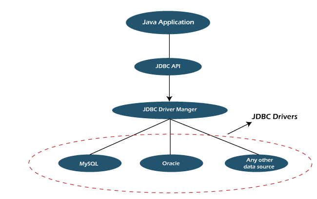

# HTTP Server

- **Plain text(text-base) protocol** : is a communication protocol whose content representation is string(human-readable format)

- **Stateless protocol** :(no save information) is a type protocol in which their clients send a server request after which the server responds based on the current state. A stateless protocol doesn't require a server to retain the infomation of a session or the status of every communicating partner in mutiple requests.

## Request
- **Resource URL** `(protocol://ip:port/path/{pathParm}?{queryParm})`
    - `Path`: to determine which implementation of API for "this" request. The same protocol can have many implementations.
    - QueryParam: is not path of URL and passed in key=value format those parameters must be defined by API developer. Ex : `http://localhost:4567/read/userId=1234`
    - PathParam: path parameters are variable parts of URL path. They are typically used to point to specific resource within a collection. Ex: `http://localhost:4567/read/1234`

- **Header(Meta data)** : Contains descriptive information about request or response(additional information) between client and server

- **Body(data)** : is the data bytes transmitted in an HTTP transaction message immediately following the headers if there are any.

## 9 Method of HTTP: 
- `GET, HEAD(no body)` : SAFE MODE(No action on server).
- `POST, PUT, PATCH` : Message with body(send data to server).
- `OPTIONS, TRACE`
- `DELETE` : Delete a resource (Not guaranteed)

- **Status** :
    - 200: success
    - 404: client error
    - 500: server error


# Database connection:

- **JDBC (Java Database Connectivity)**: is the API that manages connecting to a database, issuing queries and commands, and handing results set obtained from the database, helping users to interact or communication with various database.



- *Java Application*: is a progarm written in Java that is executed stand-alone either in a client or a server.
- *JDBC API*: consist of following interfaces and classes DriverManager, Driver, Connection, Statement, ResultSet, Exception...
- *JDBC DriverManager*: is class manages a list of database drivers(Ex: mysql driver in mysql-connector library). It matches connection requests from the java application with the proper database driver using communication subprotocol.
- *JDBC Driver*: is an interface enabling a Java application to interact with a database. To connect with individual database, JDBC requires implementation driver for each database. The JDBC driver gives out the connection to the database and implements the protocol for transferring the query and result between client and database.

- **DataSource** and **the DriverManager** are the two basic ways to connect to a database.

**(Brige Desgin Pattern???)**

## DriverManager in JDBC

- DriverManager class is the component of JDBC API and also member of the java.sql package. 
- The Driver Manager class is the traditional management layer of JDBC, working between the Java Application and drivers. It keeps track of the drivers that are available and handle establishing a connection between database and the appropriate driver. In addition, the DriverManager class attends to things like driver login time limits and the printing of log and trace messages.
- DriverManager does not provide connection pooling.

- **Database connection**: 
This fully implemented class connects an application to a data source, which is specified by a database URL.
    > For each request, establish a connection with the database through DriverManager in the JDBC connector. Execute the query, modify or update. Once done, close the connection.

    ```java
        Connection conn = null;
        PreparedStatement stmt = null;
        try {
            // connect with database using driverManager in jdbc
            Class.forName("DriverName");
            conn = DriverManager.getConnection(<databaseURL>, <userName>, <password>);
            stmt = conn.prepareStatement(<sqlQuery statement>);
            ResultSet rs = stmt.executeQuery();
            // DO SOMETHING
            ...

        } catch (SQLException e) {
            e.printStackTrace();
            System.out.println("An error occurred. Maybe userName/password invalid");
            System.out.println(e.getMessage());
        } catch (ClassNotFoundException e) {
            e.printStackTrace();
            System.out.println("Could not find database driver class");
            System.out.println(e.getMessage());
        } finally {
            if (conn != null) {
                try {
                    conn.close();
                } catch (SQLException e) {
                    e.printStackTrace();
                }
            }
        }
    ```

## DataSource in JDBC
> Java DataSource 
*Java DataSource is approach loose coupling for connectivity so that we can switch database easily, connection pooling for transaction management and distribution systems support.*
- `Java DataSource interface` is present in javax.sql pakage and it only declare two overleaded methods `getConnection()` and `getConnection(String str1, String str2)`.

> JDBC DataSource
- It is the reposibility of difference Database vendors to provide difference kinds of implementation of DataSource Interface. For example: `com.mysql.jdbc.jdbc2.optional.MysqlDataSource` class and Oracle database driver implement it with `oracle.jdbc.pool.OracleDataSource` class. . These implementation classes provide methods through which we can provide database server details with user credentials. Some of the other common features provided by these JDBC DataSource implementation classes are:
    - Catch of PreparedStatement for faster processig.
    - Connection timeout settings.
    - Logging features.
    - ResultSet maximum size threshold.

**Connection Pool**

- *A connection pool is a cache of database connections maintained so that the connections can be reused when future requests to the database required.*

- Connection Pooling is a technique used for the reuse of physical connections and reducing overhead for an application. Connection pooling functionality minimizes expensive operations in the creation and closing of sessions on connections. Database vendors help multiple clients to share a cached set of connection objects that provides access to a database. The client does need not to create connection every time to interact with the database.

```java
    // Datasource object to get connection in connection pool
    private HikariDataSource ds;

    // get a connection of connection pool
    public Connection getConnection() throws SQLException{
        return ds.getConnection();
    }

    private DbCpModel() {
        // config HikariCp connection pool
        HikariConfig config = new HikariConfig();
        config.setDriverClassName("<driverName>");
        config.setJdbcUrl("<url>");
        config.setUsername("usernName");
        config.setPassword("password");
        // implement datasource object
        ds = new HikariDataSource(config);
    }
```
- Example for DataSource: HikariCp(Hikari connection pool) is an implementation of JDBC DataSource, which provides a connection pools mechanism. 

# Programming
## Singleton pattern

*The singleton pattern is a software design pattern the retricts instantiation of class to one "single" instance. This is useful when exactly one object is needed to coordinate actions across the system.*

- **Singleton for `DbCpModel`**:
    - The connection pool technique reduces the overhead of creating and closing of connections by making connections available in the pool. Java application does need no to craete a connection every time interact with the database. Thanks to it improve response time of any application that requires connections.
    - Avalible connections in pool occupy a part of system resource.
    - If Instances of DbCpModel are freely instantiated (No control) result to very system resource are accupied(Very resource intensive).
    - Singleton Pattern ensures only one connection pool.

- **Singleton for `UserModel`**: **(!TODO)**    
    - Advantage ??? 
    - If not using singleton design pattern???

- SingletonHolder : **(!TODO)** 
    - Advantage? 
    - Disadvantage

- All fields and method is static. (!TODO) 
    - Advantage? 
    - Disadvantage


### Implementations 

> Implementations of singleton pattern must :
- Ensure that only one instance of singleton class ever exist.
- Provide global access to that instance.

> Typically, this is done by :
- Declaring all constructor of class to be private.
- Providing a static method that return a reference to the instance.

## Lazy load(!TODO)
- In UserModel and DbCpModel singlton class, INST is the only instace of class. 
- The instance is not implemented when program is started until the first request for a resource occurs.

**Advantage**
- *Reduces initial load time*: lazy loading a webpage reduce page weight, allowing for quicker page load time. 
- *Bandwith conservation*: Lazy loading conserves bandwith by delivering contents to user only if it's requested.
- *Systems resource usage*: Lazy loading conserver both server and clinet resource, because something of images, JavaScrpit or other code actually need to be rendered or executed.

# Project Information (!TODO)

## Language: Java - OpenJDK 11.0.16

## Tools build: Gradle 7.5.1
- gradle init: initialize project
- gradle build: build project
- gradle run (--stacktrace option): run project

## Sparkjava
- SparkJava is a http server
- [SparkJava Documentation](https://sparkjava.com/documentation#views-and-templates)


- **My job: Provide implementation of functional interface(Interface Route) in Spark**.

## HikariCp(!TODO)
- *HikariCp is JDBC connection pool.*

- DataSource: A DataSource object provides a new way for JDBCs clients to obtain a DBMS connection.

- [HikariCp Documentation](https://github.com/brettwooldridge/HikariCP)

## Libraries (!TODO)
- HTTP Server: Sparkjava
- Lombok: Project Lombok is a java library that automatically plugs into editor and build tools, spicing up your java.
- Gson: is Java library that can be convert Java Object to into their JSON representation. It also can be used to conver a JSON string to an equivalent Java object.
- HikariCp: Database connection pool
- MySql-Connector: contain mysql driver class.


## Entity: Contain data of object
- User: Contains user information(represents user data in database).
- Http Response: (!TODO)

## Model: Perform operations and logic on the respective entities
- UserModel: Performs operations on user entitys.
- DbCpModel: Contains Connection Pool, manages get connection to database.

## Cache
*Reduce response time to clinet if data already in cache/*
- Cache in UserModel: store user data to respond for the request, if data already exists in the cache, it does not need to query to the database.
- Cache in DbCpModel is Connection Pool.

## Library
- Router is functional interface which throws Exception(alternative Route Functional Interface in spark library).

## Wrap Http methods of SparkJava into HttpServer Class
- Wrap http methods of SparkJava into HttpServer: 
    - Implement `Functional Interface Route`(*Override handle abtract method*) by `HttpServer.process(...)` method.
    - Catch Exceptions of methods in `UserModel` in `HttpServer.process` method.
- Service : ???

# Addtional Information
## Variable naming conventions
- **Pascal**: VariableName   - Class(Java, Python, Js, C++)
- **camel**: variableName    - method, function, variable(Java, Js)
- **snake_case**: variable_Name  - method, function, varible(python); column name(MyySQL)
- **kebab-case**: variable-Name  - variable(css), linux-path

# QUESTION
- What is difference between static and non-static when first run program.
- What is difference between thread and process when parallel requests request at the same time.